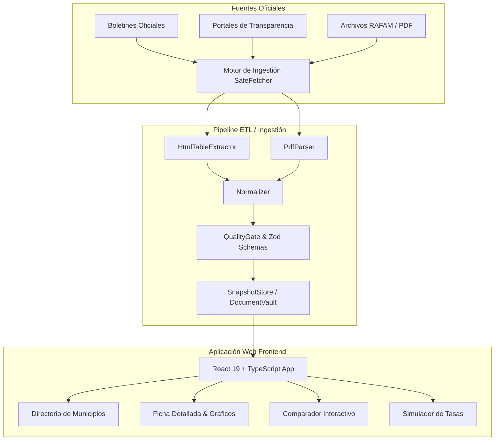

<div align="center">

# 🏛️ InformAR

**Plataforma cívica de datos abiertos, visualización y análisis de finanzas públicas municipales en Argentina.**

[](https://react.dev/)
[](https://www.typescriptlang.org/)
[](https://vitejs.dev/)
[](https://tailwindcss.com/)
[](https://opensource.org/licenses/MIT)

[Características](#-características-principales) •
[Arquitectura](#-arquitectura-del-sistema) •
[Motor de Ingestión](#-motor-de-ingestión-y-scraping-cívico) •
[Instalación](#-instalación-y-uso) •
[Estructura](#-estructura-del-proyecto) •
[Metodología](#-metodología-y-datos)

</div>

---

## 📌 Visión del Proyecto

**InformAR** es una iniciativa de **Tecnología Cívica (CivicTech)** concebida para democratizar el acceso a la información fiscal y presupuestaria de los municipios argentinos. Transforma documentos oficiales complejos, boletines oficiales y reportes presupuestarios (RAFAM / Tribunales de Cuentas) en información clara, interactiva y auditable para ciudadanos, periodistas, investigadores y organizaciones de la sociedad civil.

---

## ✨ Características Principales

### 1. 🏛️ Directorio y Explorador de Municipios
- Búsqueda en tiempo real con atajo global (**⌘K** / **Ctrl+K**).
- Filtros por provincia, tamaño poblacional, presupuesto total e índice de transparencia.
- Fichas individuales con métricas per cápita y trazabilidad de fuentes oficiales.

### 2. 📊 Ficha Detallada Municipal
- **Resumen Ejecutivo:** Gasto por habitante, presupuesto vigente vs. ejecutado y semáforo de rendición de cuentas.
- **Evolución Presupuestaria:** Gráficos temporales interactivos de ingresos y gastos.
- **Licitaciones y Contrataciones:** Tabla auditable de llamados, adjudicaciones, montos y proveedores con links a pliegos oficiales.
- **Obras Públicas:** Línea de tiempo y estado de avance de obras con georreferenciación y fuentes.
- **Rendición de Cuentas:** Publicación y seguimiento de ejercicios contables (RAFAM y dictámenes de Tribunales de Cuentas).

### 3. ⚖️ Comparador Municipal
- Comparación lado a lado de 2 o más municipios.
- Análisis comparativo de gasto por habitante, distribución por áreas (salud, seguridad, obra pública) y niveles de apertura de datos.

### 4. 💸 Simulador "¿A Dónde Va la Plata?"
- Calculadora ciudadana interactiva: ingresá tu aporte de tasas municipales y visualizá en tiempo real exactamente cuántos pesos se destinan a cada servicio público.

### 5. 📐 Metodología Abierta y Transparente
- Criterios claros de ponderación del **Índice de Transparencia Municipal (0 a 100)**.
- Clasificación de fuentes con badges de confiabilidad y trazabilidad a los documentos fuente originales.

---

## 🏗️ Arquitectura del Sistema



---

## 🛰️ Motor de Ingestión y Scraping Cívico

El proyecto incluye un pipeline ETL robusto y seguro ubicado en `ingestion/`:

- **🔒 Seguridad Anti-SSRF:** `SafeFetcher` valida dominios estrictamente autorizados antes de ejecutar peticiones.
- **⏱️ Rate Limiting & Backoff:** Respeto de límites de peticiones para no sobrecargar los servidores públicos.
- **📑 Extracción Híbrida:** Soporte para HTML dinámico (`Cheerio`) y documentos PDF oficiales (`pdf-parse`).
- **🛡️ Quality Gate:** Validación estricta con esquemas `Zod` para garantizar integridad y tipos de datos consistentes.
- **💾 Versionado de Snapshots:** Almacenamiento inmutable de reportes con hash y trazabilidad temporal.

---

## 🚀 Instalación y Uso

### Prerrequisitos
- **Node.js**: v18.0.0 o superior (recomendado v20+)
- **npm** o **pnpm** / **yarn**

### 1. Clonar el repositorio
```bash
git clone https://github.com/arsabot/informar-app.git
cd informar-app
```

### 2. Instalar dependencias
```bash
npm install
```

### 3. Iniciar el servidor de desarrollo
```bash
npm run dev
```
La aplicación estará disponible en `http://localhost:5173`.

### 4. Ejecutar el pipeline de datos (Ingestión)
```bash
# Ejecutar pipeline de extracción y generación de snapshots
npm run ingest

# Correr tests del módulo de ingestión
npm run test:ingest
```

### 5. Compilar para producción
```bash
npm run build
```

---

## 📂 Estructura del Proyecto

```text
informar-app/
├── ingestion/                  # 📡 Pipeline ETL y Scraping Cívico
│   ├── adapters/               # Conectores por municipio (ej: MerloAdapter)
│   ├── core/                   # SafeFetcher, BaseAdapter, tipos base
│   ├── data/                   # Reportes de auditoría y snapshots crudos
│   ├── parsers/                # Extractores de tablas HTML y parsers PDF
│   ├── storage/                # SnapshotStore y DocumentVault
│   ├── tests/                  # Tests unitarios del pipeline
│   ├── validators/             # QualityGate y esquemas Zod
│   └── runner.ts               # Punto de entrada de la ingestión
│
├── public/                     # 🌐 Recursos estáticos e íconos SVG
├── src/                        # 💻 Código fuente Frontend (React + TS)
│   ├── assets/                 # Imágenes y gráficos
│   ├── components/
│   │   ├── charts/             # Gráficos Recharts (Evolución, Donut, etc.)
│   │   ├── common/             # Badges de fuentes, tarjetas, tooltips
│   │   ├── layout/             # Navbar, Footer, DemoBanner, SearchModal
│   │   └── sections/           # Tablas de contratos, obras, simulador
│   ├── data/                   # Datos estructurados y snapshots de municipios
│   │   ├── municipalities/     # Data individual por distrito (presupuesto, obras)
│   │   └── municipios.ts       # Directorio maestro de municipios
│   ├── services/               # Servicios de consulta y agregación de datos
│   ├── types/                  # Definiciones de TypeScript y modelos
│   ├── utils/                  # Utilidades de seguridad y formato monetario
│   ├── views/                  # Vistas principales (Landing, Detalle, Comparar, etc.)
│   ├── App.tsx                 # Enrutamiento y estado global
│   ├── main.tsx                # Entrada principal React DOM
│   └── index.css               # Estilos globales y Tailwind CSS
│
├── .gitignore                  # Reglas de exclusión de Git
├── package.json                # Dependencias y scripts del proyecto
├── tailwind.config.js          # Configuración del sistema de diseño
├── tsconfig.json               # Configuración de TypeScript
└── vite.config.ts              # Configuración del bundler Vite
```

---

## 📊 Metodología y Datos

1. **Datos Oficiales y Verificables:** No se proyectan ni estiman datos sin respaldo documental oficial.
2. **Atribución de Fuente:** Cada dato visualizado enlaza directamente a su fuente oficial (Boletín, Decreto, Tribunal de Cuentas o RAFAM).
3. **Código Abierto:** Todos los extractores y metodologías de cálculo son públicos y reproducibles.

---

## 🤝 Contribuir

¡Las contribuciones de la comunidad son bienvenidas!

1. Hacé un Fork del proyecto.
2. Creá tu rama con la nueva funcionalidad (`git checkout -b feature/nuevo-municipio`).
3. Creá el adaptador correspondiente en `ingestion/adapters/` y su vista de datos.
4. Hacé commit de tus cambios (`git commit -m 'feat: agregar conector para Municipio X'`).
5. Hacé Push a tu rama (`git push origin feature/nuevo-municipio`).
6. Abrí un Pull Request.

---

## 📄 Licencia

Este proyecto está bajo la Licencia MIT. Consultá el archivo `LICENSE` para más detalles.
